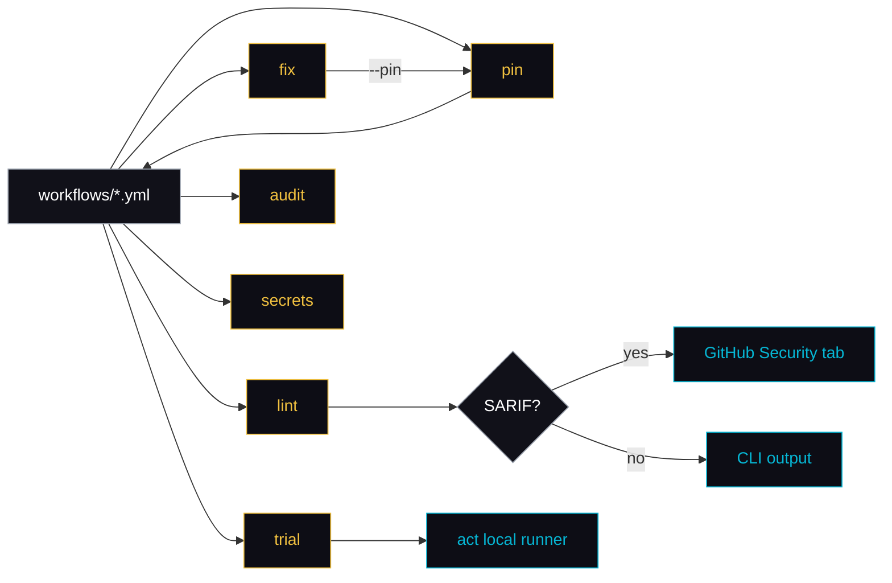
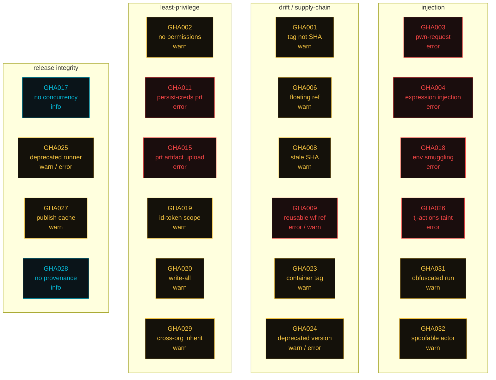
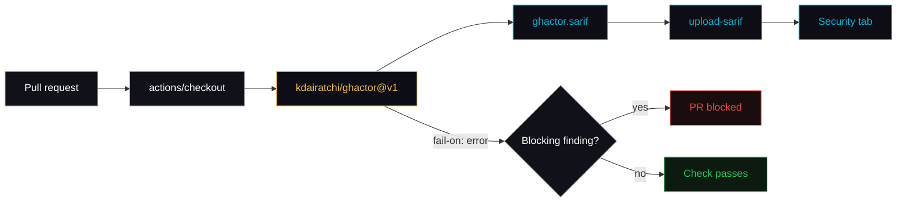

<div align="center">


# ghactor

**Security-first CLI for GitHub Actions.** Lint, fix, SHA-pin, audit for known-vulnerable actions, scan for secrets, trial-run, and inspect recent runs — from one binary.

<p>
  <a href="https://github.com/kdairatchi/ghactor/releases"></a>
  <a href="https://pkg.go.dev/github.com/kdairatchi/ghactor"></a>
  <a href="https://github.com/kdairatchi/ghactor/blob/main/LICENSE"></a>
  <a href="https://github.com/kdairatchi/ghactor/actions"></a>
</p>

</div>

---

## Why ghactor

GitHub Actions is a supply-chain minefield. Floating `@main` tags drift under you. Missing `permissions:` blocks default to *write-all*. A careless `pull_request_target` plus a PR-head checkout is full repo takeover. Most teams catch this in review — if at all.

ghactor catches it before the workflow ships:

- **`lint`** wraps `actionlint` with 31 security rules focused on what actually gets exploited (pwn-request, injection, stale pins, cache poisoning, env smuggling, tj-actions-style taint propagation, deprecated runners, cross-org `secrets: inherit`).
- **`pin`** rewrites every `uses:` to a 40-char SHA with the original tag preserved as a comment, so upgrades still diff cleanly.
- **`fix`** auto-adds `permissions:`, job timeouts, shell pinning, and optional SHA pinning in a single pass.
- **`gen`** scaffolds hardened workflow YAML (CI, CodeQL, release + attest-build-provenance, Dependabot) pinned to SHAs out of the box.
- **`audit`** cross-checks pinned actions against the GitHub Advisory Database, flags archived repos, and catches 404'd actions.
- **`doctor`** gives you a 0–100 posture score for the whole repo.

One binary, zero Node runtime, ships as a composite Action or a CLI.

## Install

```sh
go install github.com/kdairatchi/ghactor/cmd/ghactor@latest
```

Requires `gh` (GitHub CLI) for `pin`, `update`, `audit`. Requires [`act`](https://github.com/nektos/act) for `trial`. `trail` uses GitHub REST directly (reads `GITHUB_TOKEN` / `GHACTOR_GITHUB_TOKEN`; falls back to `gh` when no token is set). GHES is supported via `GITHUB_API_URL`.

## How it fits together



## Commands

| Command     | What it does                                                                    |
|-------------|---------------------------------------------------------------------------------|
| `lint`      | Run rhysd/actionlint **and** ghactor's security rules (GHA001–GHA032)           |
| `pin`       | Rewrite `uses: owner/repo@tag` to `@<40-char SHA> # tag` via `gh api`           |
| `fix`       | Add missing `permissions:`, inject `timeout-minutes:`, pin shells/containers    |
| `update`    | Show which actions have newer releases (via `gh api .../releases/latest`)      |
| `audit`     | Cross-check pinned actions against GHSA; flag archived + 404 repos             |
| `secrets`   | Gitleaks-style scan of workflow YAML for leaked API keys, tokens, private keys |
| `baseline`  | Snapshot current findings so CI only fails on *new* issues (legacy adoption)   |
| `trial`     | Shell to `act` to run a workflow locally                                        |
| `trail`     | Pretty-print recent runs with success/fail/avg duration                         |
| `doctor`    | Repo-wide health report with 0–100 score                                        |
| `rules`     | List all ghactor rules                                                          |
| `explain`   | Print a card for a single rule (description, remediation, fix example)          |
| `gen`       | Scaffold hardened workflows (ci-go, ci-node, codeql, release-goreleaser, …)     |
| `watch`     | Re-lint on YAML change (fsnotify-based, debounced)                              |
| `sarifdiff` | Diff two SARIF reports — surface new findings between baseline and head         |

## Rules

The 31 rules group into four lanes — **injection**, **drift / supply-chain**, **least-privilege**, and **release integrity**. `lint` runs all of them by default.



Full detail: `ghactor rules --verbose` or `ghactor explain GHA004`.

| ID      | Severity   | What                                                                                                 |
|---------|------------|------------------------------------------------------------------------------------------------------|
| GHA001  | warn       | Action pinned by tag, not 40-char SHA                                                                |
| GHA002  | warn       | No `permissions:` block — defaults to write-all                                                      |
| GHA003  | error      | `pull_request_target` + checkout of PR head ref (pwn-request pattern)                               |
| GHA004  | error      | Untrusted `${{ github.event.* }}` interpolated into `run:` (injection)                              |
| GHA005  | info       | Job has no `timeout-minutes:` (default 360)                                                          |
| GHA006  | warn       | Action pinned to floating ref (`@main`, `@master`, `@latest`, `@HEAD`)                              |
| GHA007  | warn       | `uses:` with no `@ref` at all                                                                        |
| GHA008  | warn       | Pinned SHA is stale — the `# tag` comment resolves to a different SHA; requires `Resolver` in opts  |
| GHA009  | error/warn | Reusable workflow ref is a floating branch (error) or a semver tag rather than a SHA (warning)      |
| GHA010  | error      | Action matches a `deny_actions` glob pattern from `.ghactor.yml`                                     |
| GHA011  | error      | `actions/checkout` with `persist-credentials: true` under `pull_request_target` (token theft)        |
| GHA012  | warn       | `run:` contains `curl \| sh` / `wget \| bash` pattern (remote code execution)                        |
| GHA013  | warn       | `actions/cache` key derived from untrusted `github.event.*` / `inputs.*` (cache poisoning)           |
| GHA014  | error      | Legacy `::set-env` / `::add-path` / `ACTIONS_ALLOW_UNSECURE_COMMANDS=true` (disabled since Nov 2020) |
| GHA015  | error      | `actions/upload-artifact` under `pull_request_target` (artifact exfil of secrets)                    |
| GHA016  | warn       | `self-hosted` runner with no restrictive labels — fork PRs can target it                             |
| GHA017  | info       | Deploy/release workflow has no `concurrency:` block (double-deploy race)                             |
| GHA018  | error      | Untrusted expression written to `$GITHUB_ENV` / `$GITHUB_OUTPUT` (env smuggling)                     |
| GHA019  | warn       | Job requests `id-token: write` — verify OIDC trust policy constrains `sub`/`aud`                     |
| GHA020  | warn       | `permissions:` grants `write-all` / broad `write` — narrow to least-privilege                        |
| GHA021  | warn       | Reusable workflow `workflow_call` input is untyped — pin `type:` to prevent coercion                 |
| GHA022  | info       | Step `run:` block with no `shell:` — default drifts across runners (bash vs. pwsh)                   |
| GHA023  | warn       | `container:` / `services.*.image:` pinned by tag, not digest — rewrite to `image@sha256:…`           |
| GHA024  | warn/error | Action pinned to deprecated major (e.g. `actions/upload-artifact@v3` — hard-fail since 2025-01-30)   |
| GHA025  | warn/error | Job uses deprecated/removed runner image (`ubuntu-20.04`, `macos-12`, `windows-2019`, …)             |
| GHA026  | error      | `GHA004` promotion — untrusted `steps.<id>.outputs.*` from a known-tainted action (CVE-2023-27529)   |
| GHA027  | warn       | Publish/release workflow restores a build cache — feature-branch cache poisoning into release        |
| GHA028  | info       | Publish/release workflow has no `actions/attest-build-provenance` step                               |
| GHA029  | warn       | Reusable workflow from external org with `secrets: inherit` — forwards all repo secrets              |
| GHA030  | error      | Action not in `.ghactor.yml` `allow_actions:` allowlist (opt-in — only fires when list is set)       |
| GHA031  | warn       | `run:` block obfuscation — base64 decode piped to shell, `eval` of `${{ }}`, `curl \| bash` chains   |
| GHA032  | warn       | Job `if:` gating on spoofable `github.actor` / `[bot]` identity match                                |

## Examples

```sh
# Lint everything
ghactor lint

# Just the ghactor rules, skip timeouts noise
ghactor lint --only-ghactor --disable GHA005

# Pipe to jq for CI dashboards
ghactor lint --json | jq '.[] | select(.severity=="error")'
ghactor lint --baseline .ghactor/baseline.json  # suppress known findings; report NEW only
ghactor lint --resolve-drift                    # online: GHA008 stale-SHA check via gh api
ghactor lint --junit ghactor.junit.xml          # JUnit XML (Jenkins/GitLab CI)
ghactor lint --github                           # GH Actions workflow annotations on stdout
ghactor lint --actions .                        # also lint composite action.yml files
ghactor lint --since origin/main                # only lint files changed in this PR

ghactor explain GHA004                          # print full card for a rule
ghactor explain GHA020 --json                   # machine-readable rule metadata

ghactor gen                                     # list available templates
ghactor gen ci-go -o .github/workflows/ci.yml   # scaffold a hardened Go CI workflow
ghactor gen attest-release --force              # SLSA build-provenance release
ghactor gen dependabot -o .github/dependabot.yml

ghactor watch                                   # auto-re-lint on YAML change
ghactor watch --clear --debounce 150ms          # fast dev loop

# Preview / apply SHA pinning (cache at .ghactor/cache.json, 30-day TTL)
ghactor pin --dry-run
ghactor pin

# One-shot hardening: perms + 15-min timeouts + pin every action + shells + containers
ghactor fix --all --timeout 15

ghactor audit                                   # check pinned actions against GHSA
ghactor audit --offline --json                  # static deny list only, machine-readable
ghactor audit --no-archival --no-missing        # skip archived/404 repo checks
ghactor secrets --entropy                       # scan + high-entropy string detection

ghactor baseline create                         # snapshot current findings
ghactor baseline status --fail-on error         # CI-mode: fail only on NEW findings
ghactor baseline prune                          # drop fingerprints that no longer match

ghactor doctor                                  # scored health report
ghactor trail -n 50                             # last 50 runs
ghactor trial -e pull_request                   # run locally via act
```

## Exit codes

`lint` exits `1` on findings at or above `--fail-on` (default `warning`). Use `--fail-on error` in CI when you only want to block on real security issues — everything else stays a signal, not a blocker.

## Using in CI



**As a composite action** — findings land in the Security tab via SARIF:

```yaml
name: ghactor
on: [push, pull_request]
permissions:
  contents: read
  security-events: write
jobs:
  lint:
    runs-on: ubuntu-latest
    steps:
      - uses: actions/checkout@11bd71901bbe5b1630ceea73d27597364c9af683 # v4
      - uses: kdairatchi/ghactor@v1
        with:
          fail-on: error
          disable: GHA005
```

**Or call the CLI directly:**

```yaml
- uses: actions/setup-go@11bd71901bbe5b1630ceea73d27597364c9af683 # v5
  with: { go-version: stable }
- run: go install github.com/kdairatchi/ghactor/cmd/ghactor@latest
- run: ghactor lint --sarif ghactor.sarif --fail-on error
- uses: github/codeql-action/upload-sarif@v3
  if: always()
  with:
    sarif_file: ghactor.sarif
    category: ghactor
```

## Config

Optional `.ghactor.yml` at the repo root:

```yaml
fail_on: warning          # error | warning | info
disable:                  # skip specific rules
  - GHA005
deny_actions:             # glob patterns → GHA010 error
  - "some-untrusted-org/*"
  - "*/shady-action"
allow_actions:            # glob patterns → GHA030 error for anything else
  - "actions/*"
  - "myorg/*"
severity:                 # per-rule severity override
  GHA028: off             # disable an info rule entirely
  GHA005: warning         # escalate an info rule
```

---

<div align="center">

Built by [@kdairatchi](https://github.com/kdairatchi) · part of the [ProwlrBot](https://github.com/ProwlrBot) ecosystem · Licensed MIT

</div>
