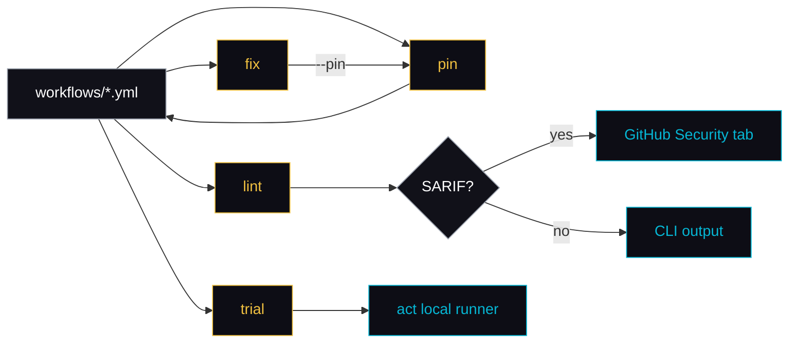
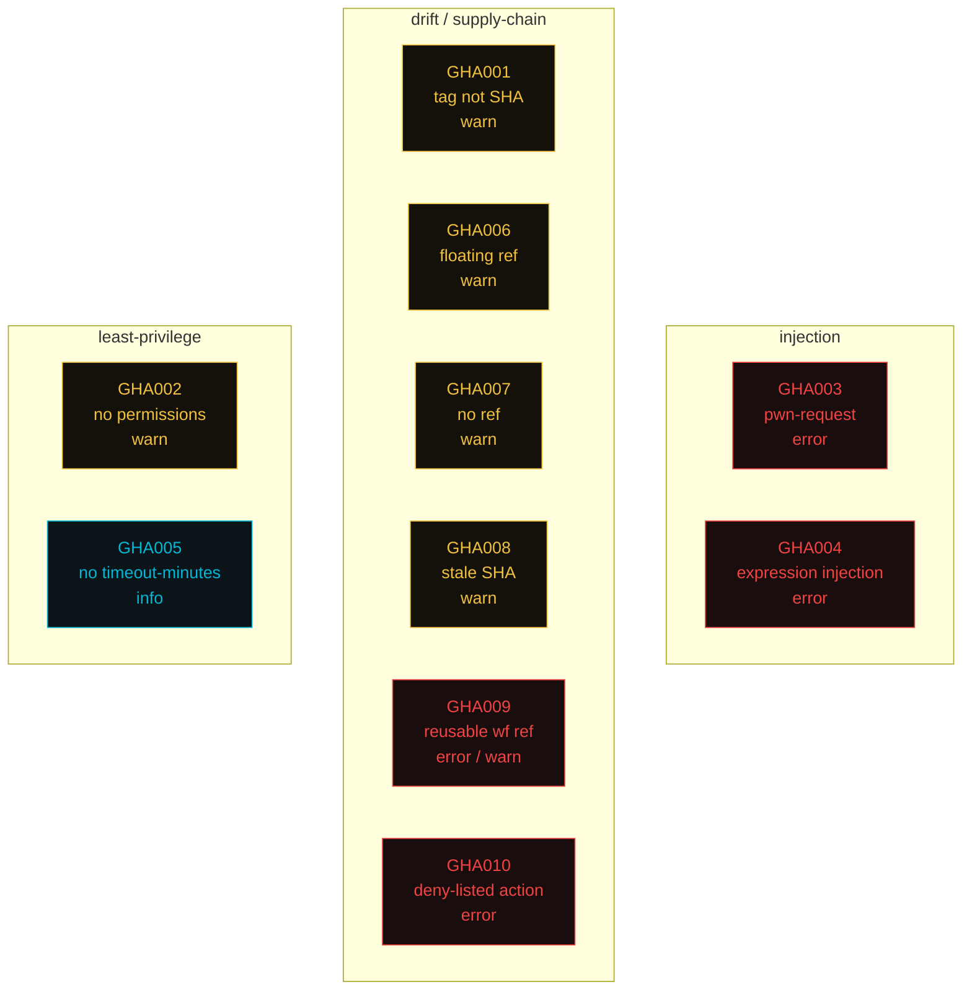
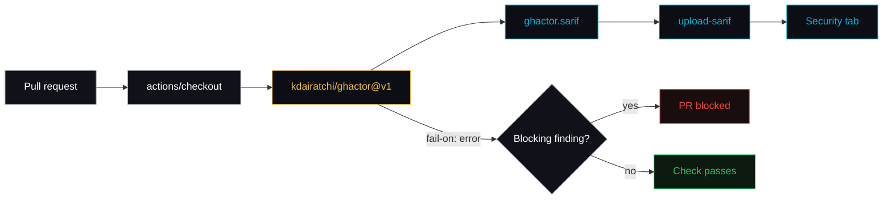

<div align="center">


# ghactor

**Security-first CLI for GitHub Actions.** Lint, fix, SHA-pin, trial-run, and audit recent runs — from one binary.

<p>
  <a href="https://github.com/kdairatchi/ghactor/releases"></a>
  <a href="https://pkg.go.dev/github.com/kdairatchi/ghactor"></a>
  <a href="https://github.com/kdairatchi/ghactor/blob/main/LICENSE"></a>
  <a href="https://github.com/kdairatchi/ghactor/actions"></a>
</p>

</div>

---

## Why ghactor

GitHub Actions is a supply-chain minefield. Floating `@main` tags drift under you. Missing `permissions:` blocks default to *write-all*. A careless `pull_request_target` plus a PR-head checkout is full repo takeover. Most teams catch this in review — if at all.

ghactor catches it before the workflow ships:

- **`lint`** wraps `actionlint` with ten security rules focused on the things that actually get exploited (pwn-request, injection, floating refs, stale pins).
- **`pin`** rewrites every `uses:` to a 40-char SHA with the original tag preserved as a comment, so upgrades still diff cleanly.
- **`fix`** auto-adds `permissions:`, job timeouts, and optional SHA pinning in a single pass.
- **`trial`** shells to `act` so you run the workflow locally before you merge.
- **`doctor`** gives you a 0–100 posture score for the whole repo.

One binary, zero Node runtime, ships as a composite Action or a CLI.

## Install

```sh
go install github.com/kdairatchi/ghactor/cmd/ghactor@latest
```

Requires `gh` (GitHub CLI) for `pin`, `update`, and `trail`. Requires [`act`](https://github.com/nektos/act) for `trial`.

## How it fits together



## Commands

| Command   | What it does                                                                      |
|-----------|-----------------------------------------------------------------------------------|
| `lint`    | Runs `actionlint` **plus** ghactor's security rules (GHA001–GHA010)               |
| `pin`     | Rewrites `uses: owner/repo@tag` to `@<40-char SHA> # tag` via `gh api`            |
| `fix`     | Adds missing `permissions:`, injects `timeout-minutes:`, optionally pins          |
| `update`  | Shows which actions have newer releases (via `gh api .../releases/latest`)        |
| `trial`   | Shells to `act` to run a workflow locally                                         |
| `trail`   | Pretty-prints recent runs with success/fail/avg duration (via `gh run list`)      |
| `doctor`  | Repo-wide health report with a 0–100 score                                        |
| `rules`   | Lists all ghactor rules                                                           |

## Rules

The ten rules group into three lanes — **injection**, **drift**, and **least-privilege**. `lint` runs all of them by default.



Full detail: `ghactor rules --verbose`.

| ID      | Severity     | What                                                                                           |
|---------|--------------|------------------------------------------------------------------------------------------------|
| GHA001  | warn         | Action pinned by tag, not 40-char SHA                                                          |
| GHA002  | warn         | No `permissions:` block — defaults to write-all                                                |
| GHA003  | error        | `pull_request_target` + checkout of PR head ref (pwn-request pattern)                          |
| GHA004  | error        | Untrusted `${{ github.event.* }}` interpolated into `run:` (shell injection)                   |
| GHA005  | info         | Job has no `timeout-minutes:` (default 360)                                                    |
| GHA006  | warn         | Action pinned to floating ref (`@main`, `@master`, `@latest`, `@HEAD`)                         |
| GHA007  | warn         | `uses:` with no `@ref` at all                                                                  |
| GHA008  | warn         | Pinned SHA is stale — `# tag` comment resolves to a different SHA (requires `Resolver` opt)    |
| GHA009  | error / warn | Reusable-workflow ref is a floating branch (error) or a semver tag rather than a SHA (warn)    |
| GHA010  | error        | Action matches a `deny_actions` glob in `.ghactor.yml`                                         |

## Examples

```sh
# Lint everything
ghactor lint

# Just the ghactor rules, skip timeouts noise
ghactor lint --only-ghactor --disable GHA005

# Pipe to jq for CI dashboards
ghactor lint --json | jq '.[] | select(.severity=="error")'

# Preview SHA pinning without writing
ghactor pin --dry-run

# Rewrite in place (cache lands in .ghactor/cache.json)
ghactor pin

# One-shot hardening: perms + 15-min timeouts + pin every action
ghactor fix --timeout 15 --pin

# Scored posture report
ghactor doctor

# Last 50 runs, color-coded
ghactor trail -n 50

# Local trial run via act
ghactor trial -e pull_request
```

## Exit codes

`lint` exits `1` on findings at or above `--fail-on` (default `warning`). Use `--fail-on error` in CI when you only want to block on real security issues — everything else stays a signal, not a blocker.

## Using in CI



**As a composite action** — findings land in the Security tab via SARIF:

```yaml
name: ghactor
on: [push, pull_request]
permissions:
  contents: read
  security-events: write
jobs:
  lint:
    runs-on: ubuntu-latest
    steps:
      - uses: actions/checkout@11bd71901bbe5b1630ceea73d27597364c9af683 # v4
      - uses: kdairatchi/ghactor@v1
        with:
          fail-on: error
          disable: GHA005
```

**Or call the CLI directly:**

```yaml
- uses: actions/setup-go@11bd71901bbe5b1630ceea73d27597364c9af683 # v5
  with: { go-version: stable }
- run: go install github.com/kdairatchi/ghactor/cmd/ghactor@latest
- run: ghactor lint --sarif ghactor.sarif --fail-on error
- uses: github/codeql-action/upload-sarif@v3
  if: always()
  with:
    sarif_file: ghactor.sarif
    category: ghactor
```

## Config

Optional `.ghactor.yml` at the repo root:

```yaml
fail_on: warning          # error | warning | info
disable:                  # skip specific rules
  - GHA005
deny_actions:             # glob patterns → GHA010 error
  - "some-untrusted-org/*"
  - "*/shady-action"
```

---

<div align="center">

Built by [@kdairatchi](https://github.com/kdairatchi) · part of the [ProwlrBot](https://github.com/ProwlrBot) ecosystem · Licensed MIT

</div>
